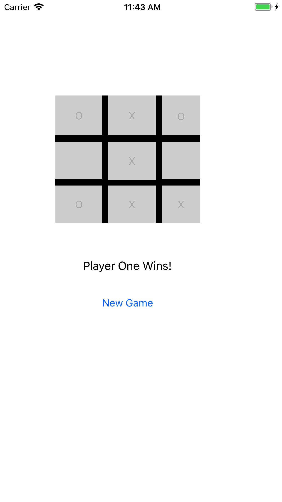
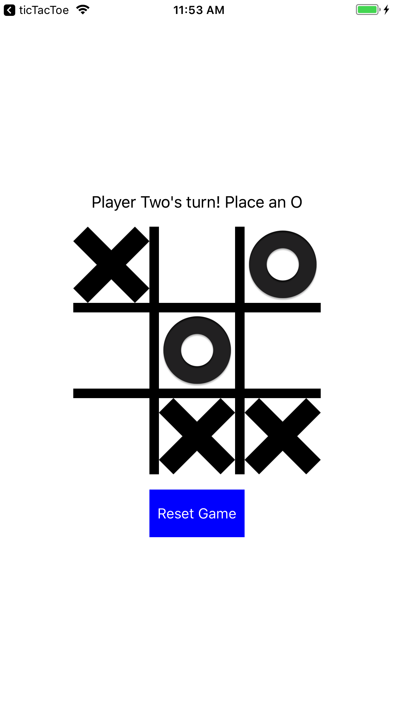
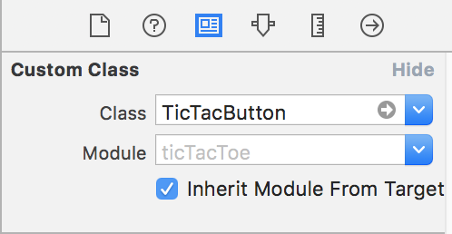
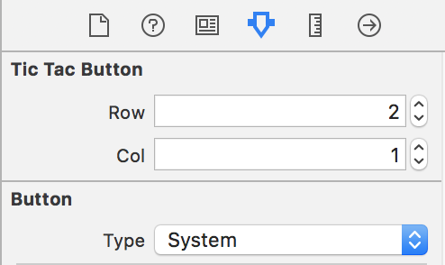
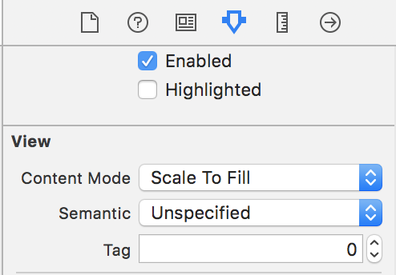

## Unit 2, Week 1 Homework

## Tic Tac Toe: Player vs. Player
### Exercise

For this assignment, you will be bringing Tic Tac Toe to life on your own.

#### Requirements:

Do worry about:
1. Alternating turns. After a player has placed down an X, the next tap must be an O.
2. Your layout must include a label to display whose turn it is and another label to keep count of the wins.
3. You must include a reset button. This resets the game, of course.
4. Win condition checking. 3-in-a-row means the game is over, so no more moves should be allowed until the reset button is tapped.

Don't worry about:
1. Don't worry too much about layout at the moment. You'll learn how to make your app pretty in a later project. See below for our ~lowered~ expectations.

Magic in Action|Hooray!
---|---
|


Alternatively, you can add images to your blue ```Assets.xcassets``` folder in the Project Navigator sidebar in case you're into that.

Yup|Don't attempt this
---|---
|


#### Hints:

1. You should use buttons for each square.
2. There is probably an easier way to do things. Instead of control-dragging 9 different outlets and actions to your ```ViewController```, you can code your logic to take in which button is clicked. Or you can do 9 drags, whatever you want.
3. You can add inspectable properties if you sub-class a button-- particular IBInspectable to keep track of rows and cols. This will help you keep track of which button is clicked. 

In Editor|Identity Inspector|Attributes Inspector
---|---|---
||
Adding these properties in your subclass|Selecting your Custom Class in the Identity Inspector|Hey look! New attributes in the Attributes Inspector!

For some extra reading on this subject, check out: http://nshipster.com/ibinspectable-ibdesignable/

4. Alternatively, you can tag your buttons within the attributes inspector.



## The ```git``` side of things

1. Fork this repo if you haven't already.
2. Clone your **own** fork to your local project directory in Terminal.
	```
	git clone https://github.com/YOURNAMEHERE/AC-iOS-tictactoe.git
	```
3. At this point you should be able to open the project in that folder and have a working table showing titles and dates. Work on the assignment and when you're done when you're done `commit` inside XCode or on the Terminal command line and then run the below. That will `push` your changes up to that branch on your fork. 
	```
	git add .
	git commit -am "I made these changes"
	git push origin master
	```
4. Feel free to `commit` early and often as a "checkpoint" of sorts to save your work.
5. Make a pull request from **your** fork to C4Q/master at the Github site once you're done.
6. Take a breather. We did it, Reddit!
